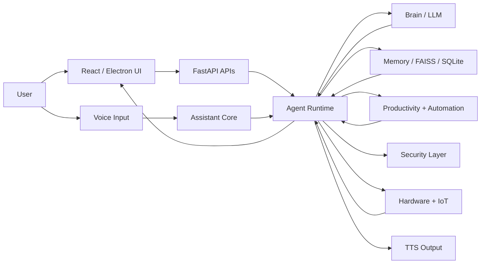

# Grandpa Assistant Production Blueprint

This document is the production architecture blueprint for `Grandpa Assistant`.
It is based on the current repository structure and is meant to guide future work
without breaking existing functionality.

## 1. Product Goal

Grandpa Assistant should behave like a human-like personal AI companion that can:

- chat naturally in English while understanding Tamil or Tanglish input
- remember important user context over time
- respond with emotional awareness
- support voice, documents, automation, productivity, and device control
- run locally first, with optional online intelligence when configured
- scale cleanly from single-user desktop usage to future multi-device usage

## 2. Current Production-Oriented Architecture

The current codebase already has a strong production-friendly base.

### Backend Runtime

- `backend/main.py`
  Backend bootstrap.
- `backend/app/api/web_api.py`
  Desktop and dashboard FastAPI surface.
- `backend/app/api/chat_api.py`
  Offline/local chat API surface.
- `backend/app/core/assistant.py`
  Terminal assistant loop.
- `backend/app/core/command_router.py`
  Main command and intent execution router.
- `backend/app/agents/`
  Multi-agent runtime, message bus, registry, and state store.
- `backend/app/shared/`
  Shared infrastructure such as config, auth, LLM access, device handling, and app data.
- `backend/app/features/`
  Product modules grouped by business domain.
- `backend/app/security/`
  Authentication, permissions, threat detection, and encryption helpers.

### Frontend Runtime

- `frontend/src/App.jsx`
  Main React app shell.
- `frontend/src/components/`
  Dashboard, chat, auth, and sidebar components.
- `frontend/electron/main.cjs`
  Electron desktop shell.
- `frontend/electron/backendManager.cjs`
  Backend process management for the desktop app.

### Data Layer

- `backend/data/assistant.db`
  Primary SQLite application store.
- `backend/data/memory.json`
  Legacy or supplemental memory state.
- `backend/data/chat_state.json`
  Legacy chat session state.
- `backend/data/mood_memory.json`
  Mood history.
- `backend/data/agent_runtime_state.json`
  Runtime agent state.
- FAISS-backed semantic memory via `backend/app/shared/brain/semantic_memory.py`

## 3. Recommended Target Folder Structure

The current structure is usable, but this is the clean target shape to preserve as the app grows.

```text
GrandpaAssistant/
|- backend/
|  |- main.py
|  |- requirements.txt
|  |- app/
|  |  |- api/
|  |  |  |- web_api.py
|  |  |  |- chat_api.py
|  |  |- agents/
|  |  |  |- base.py
|  |  |  |- catalog.py
|  |  |  |- message_bus.py
|  |  |  |- runtime.py
|  |  |  |- state_store.py
|  |  |- core/
|  |  |  |- assistant.py
|  |  |  |- command_router.py
|  |  |  |- intent_router.py
|  |  |- features/
|  |  |  |- automation/
|  |  |  |- integrations/
|  |  |  |- intelligence/
|  |  |  |- productivity/
|  |  |  |- security/
|  |  |  |- system/
|  |  |  |- vision/
|  |  |  |- voice/
|  |  |- security/
|  |  |- shared/
|  |  |  |- brain/
|  |  |  |- cognition/
|  |  |  |- controls/
|  |  |  |- utils/
|  |- assets/
|  |- data/
|  |- logs/
|- frontend/
|  |- src/
|  |  |- components/
|  |  |- constants/
|  |  |- utils/
|  |  |- App.jsx
|  |- electron/
|  |- assets/
|- mobile/
|- docs/
|- scripts/
|- tests/
|- main.py
```

## 4. Domain Responsibilities

### 4.1 Brain and Model Routing

Primary ownership:

- `backend/app/shared/llm_client.py`
- `backend/app/shared/offline_multi_model.py`
- `backend/app/shared/brain/ai_engine.py`

Responsibilities:

- pick local or remote model provider
- route `general`, `fast`, and `coding` tasks
- keep prompts human-like and emotion-aware
- expose simple interfaces for the assistant loop and APIs

### 4.2 Memory System

Primary ownership:

- `backend/app/shared/brain/database.py`
- `backend/app/shared/brain/semantic_memory.py`
- `backend/app/shared/cognition/context_engine.py`
- `backend/app/shared/productivity_store.py`

Responsibilities:

- short-term chat context
- long-term user preferences and facts
- semantic memory search
- mood and contextual recall
- SQLite-backed productivity persistence

### 4.3 Voice System

Primary ownership:

- `backend/app/features/voice/listen.py`
- `backend/app/features/voice/speak.py`
- `backend/app/core/assistant.py`

Responsibilities:

- speech-to-text
- text-to-speech
- wake word
- clap wake
- voice profile selection
- interruption and follow-up listening windows

### 4.4 RAG and Knowledge Retrieval

Primary ownership:

- `backend/app/api/chat_api.py`
- `backend/app/api/web_api.py`
- `backend/app/shared/brain/semantic_memory.py`

Responsibilities:

- document upload
- OCR and text extraction
- embeddings
- semantic recall
- context injection into answers

### 4.5 Productivity and Personal Companion Features

Primary ownership:

- `backend/app/features/productivity/`
- `backend/app/shared/productivity_store.py`

Responsibilities:

- tasks
- reminders
- notes
- planning
- events
- account preferences

### 4.6 Automation and System Control

Primary ownership:

- `backend/app/features/automation/`
- `backend/app/features/system/`
- `backend/app/shared/controls/`

Responsibilities:

- open apps
- execute guarded commands
- launch workflows
- background automations
- proactive suggestions

### 4.7 Security

Primary ownership:

- `backend/app/security/auth_manager.py`
- `backend/app/security/permission_engine.py`
- `backend/app/security/threat_detector.py`
- `backend/app/security/encryption_utils.py`
- `backend/app/shared/app_auth.py`

Responsibilities:

- local auth and sessions
- risk classification
- device monitoring
- prompt safety
- secure command gating

## 5. Multi-Agent Architecture

The current runtime is already a good fit for the target assistant model.

### Active Agent Roles

- `brain-agent`
  Reasoning and model status.
- `voice-agent`
  Wake word, STT, TTS, and voice mode.
- `vision-agent`
  OCR, camera, object, and face readiness.
- `task-agent`
  Productivity and planner state.
- `memory-agent`
  Semantic memory and contextual recall.
- `emotion-agent`
  Mood, sentiment, and emotional behavior adaptation.
- `plugin-manager`
  Dynamic extension management.
- `intelligence-agent`
  Insights, workflows, self-learning, decision support, and proactive nudges.

### Recommended Agent Contract

Every agent should expose:

- `agent_id`
- `snapshot()`
- `handle_event(event)`
- `heartbeat()`
- `shutdown()`

This keeps the runtime observable and easy to extend.

## 6. Full System Flow



## 7. Key Module Snippets

These are small production-style snippets that match the current codebase boundaries.

### 7.1 LLM Gateway Wrapper

```python
from app.shared.llm_client import chat_with_model


def answer_user(prompt: str, *, model: str = "mistral:7b") -> str:
    return chat_with_model(
        prompt=prompt,
        model=model,
        mode="chat",
        stream=False,
    )
```

Use one gateway entrypoint per request path so prompt logic stays consistent.

### 7.2 Agent Snapshot Pattern

```python
class AgentSnapshotMixin:
    def snapshot(self) -> dict:
        return {
            "agent_id": self.agent_id,
            "ready": True,
            "updated_at": time.time(),
            "status": self.current_status(),
        }
```

This pattern keeps the runtime API predictable.

### 7.3 Auth Dependency for FastAPI

```python
from fastapi import Depends, HTTPException, Request
from app.shared.app_auth import get_authenticated_context


def require_user(request: Request):
    context = get_authenticated_context(request.headers.get("Authorization", ""))
    if not context.get("user"):
        raise HTTPException(status_code=401, detail="Authentication required.")
    return context
```

Use this for protected dashboard, mobile, and admin routes.

### 7.4 Productivity Persistence

```python
from app.shared.productivity_store import load_task_payload, save_task_payload


def add_task(title: str):
    payload = load_task_payload()
    payload["tasks"].append({"title": title, "done": False})
    save_task_payload(payload)
    return payload
```

This is the preferred shape instead of direct JSON file writes.

### 7.5 Semantic Memory Recall

```python
from app.shared.brain.semantic_memory import search_memory


def build_memory_context(query: str) -> str:
    matches = search_memory(query, limit=3)
    return "\n".join(item["text"] for item in matches)
```

Keep semantic recall lightweight and inject only the most relevant few matches.

### 7.6 Voice Wake Flow

```python
from voice.listen import listen_for_wake_word, DOUBLE_CLAP_WAKE_TOKEN


def wait_for_wake():
    token = listen_for_wake_word()
    if token in {"hey grandpa", DOUBLE_CLAP_WAKE_TOKEN}:
        return True
    return False
```

The wake layer should stay simple and hand control back to the assistant core quickly.

### 7.7 Safe System Command Execution

```python
from app.security.permission_engine import validate_command_risk


def guarded_execute(command_text: str):
    decision = validate_command_risk(command_text)
    if not decision.get("allowed"):
        return {"ok": False, "reason": decision.get("reason")}
    return {"ok": True, "result": execute_command(command_text)}
```

Every OS-level action should flow through one permission gate.

## 8. Step-by-Step Implementation Plan

This plan assumes the current repository stays intact and is improved incrementally.

### Phase 1. Stabilize Core Services

Goals:

- unify model access behind one gateway
- reduce duplicated prompt logic
- keep one shared conversation state path
- continue migrating scattered JSON state into SQLite

Tasks:

1. Consolidate `llm_client.py`, `offline_multi_model.py`, and `ai_engine.py` behind a single service facade.
2. Keep only one canonical prompt builder for conversational replies.
3. Move remaining productivity and chat state fallbacks fully into SQLite.
4. Keep legacy JSON as import-only fallback, not primary state.

### Phase 2. Harden Voice and Humanization

Goals:

- reduce wake latency
- reduce TTS glitches
- improve natural emotional conversation

Tasks:

1. Add response caching for repeated short phrases.
2. Split startup speech from regular conversation speech.
3. Add more natural reply post-processing only on casual chat paths.
4. Add a stronger voice state dashboard and warmup strategy.

### Phase 3. Finish RAG Pipeline

Goals:

- document upload
- chunking
- embeddings
- query-time retrieval

Tasks:

1. Add a dedicated document ingestion service.
2. Normalize PDF, text, and OCR extraction into one document pipeline.
3. Store chunk metadata in SQLite and vectors in FAISS.
4. Inject only top-ranked context into the final prompt.

### Phase 4. Production Security

Goals:

- safer auth
- safer command execution
- cleaner API protection

Tasks:

1. Default APIs to local-only CORS and local binding.
2. Separate convenience biometrics from true admin auth.
3. Route all destructive commands through explicit risk gates.
4. Expand structured audit logs for every privileged action.

### Phase 5. Frontend Production Polish

Goals:

- cleaner UI state
- account management
- dashboard clarity

Tasks:

1. Split `App.jsx` into route-level containers.
2. Move chat, account, settings, and dashboard logic into isolated hooks or slices.
3. Add view states for runtime health, mood, memory, and devices.
4. Add first-run onboarding and setup health checks.

### Phase 6. Deployment and Scale

Goals:

- standalone desktop app
- mobile companion
- optional cloud readiness

Tasks:

1. Keep Electron + PyInstaller packaging as the primary desktop path.
2. Add Docker for API-only deployment.
3. Abstract auth, storage, and sync boundaries so PostgreSQL can replace SQLite cleanly later.
4. Add rate limits, health probes, and deployment profiles for desktop, LAN, and cloud.

## 9. Recommended Database Strategy

### Current Best Choice

- SQLite for local single-user production desktop usage
- FAISS for semantic recall
- JSON only for export, cache, or legacy import fallback

### Future Multi-User Upgrade

- PostgreSQL for:
  - users
  - sessions
  - chat history
  - documents
  - task and note ownership
  - audit logs
- Keep FAISS or move to a hosted vector layer only if cloud scale is needed

## 10. Suggested API Boundaries

### Public Desktop API

- `/api/auth/*`
- `/api/chat/*`
- `/api/runtime/*`
- `/api/tasks/*`
- `/api/notes/*`
- `/api/events/*`
- `/api/memory/*`
- `/api/security/*`

### Internal Service Boundaries

- `brain service`
- `memory service`
- `productivity service`
- `voice service`
- `security service`
- `automation service`

Keep service boundaries logical even if they still live in one Python process.

## 11. Scalability Best Practices

- Prefer service facades over direct cross-module imports.
- Keep all storage access behind repository or store helpers.
- Avoid writing directly to JSON from feature modules.
- Keep the agent runtime event-driven where possible.
- Use background threads only for device or audio loops that truly need them.
- Add request correlation IDs to all API logs.
- Cache model warmup and reusable voice outputs.
- Keep prompts versioned and centralized.
- Treat voice and vision backends as pluggable adapters.
- Avoid putting new business logic into `features/modules/`.

## 12. Human-Like Companion Design Rules

To keep Grandpa Assistant feeling like a person instead of a bot:

- keep casual replies short by default
- use contractions and natural language
- avoid long support-style speeches
- adjust tone using mood and context
- remember preferences without over-explaining that memory exists
- ask one simple follow-up instead of stacking many questions
- keep system messages separate from emotional chat messages

## 13. What Is Already Strong

These areas are already in good shape and should be extended, not replaced:

- multi-agent runtime foundation
- FastAPI + React + Electron packaging path
- local Ollama multi-model routing
- semantic memory foundation
- mood and feedback systems
- voice, wake, and TTS modularity
- productivity domain split
- growing SQLite application store

## 14. Highest-Impact Next Steps

If the goal is a cleaner production-grade Jarvis system, the next best engineering moves are:

1. unify the LLM gateway
2. finish SQLite migration for remaining high-value state
3. split `command_router.py` into domain command packs
4. split `App.jsx` into route and feature containers
5. centralize prompt building and response post-processing
6. complete document ingestion and RAG chunk storage
7. tighten API security defaults

## 15. Local Run Modes

### Terminal Assistant

```powershell
python main.py
```

### FastAPI Only

```powershell
uvicorn main:app --host 127.0.0.1 --port 8000
```

### Desktop App Build

```powershell
scripts\windows\build_standalone_app.cmd
```

### Frontend Build

```powershell
cd frontend
npm run build
```

## 16. Final Guidance

Do not rebuild Grandpa Assistant from scratch.

The current codebase already has the right big pieces:

- APIs
- runtime agents
- memory
- voice
- security
- desktop packaging
- frontend shell

The correct production strategy is:

- preserve what works
- consolidate duplicated logic
- finish storage unification
- improve boundaries
- polish the human experience

That path will get the project to a real, maintainable production assistant much faster than a full rewrite.
