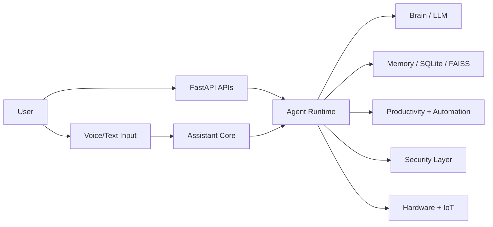

# Grandpa Assistant Production Blueprint

This document is the production architecture blueprint for the active backend-only Grandpa Assistant repository.

## Product Goal

Grandpa Assistant should behave like a local-first personal AI companion that can:

- chat naturally while preserving useful memory
- support voice, documents, automation, productivity, device control, OCR, and vision
- run on Windows first
- use local AI by default, with optional online intelligence when configured
- degrade cleanly when optional hardware or AI services are missing

## Current Backend Architecture

- `backend/desktop_backend_entry.py`
  Primary Windows desktop assistant entry point.
- `backend/main.py`
  FastAPI backend runtime entry point.
- `backend/fastapi_chat.py`
  Chat API app entry point.
- `backend/app/api/web_api.py`
  Desktop/backend API surface.
- `backend/app/api/chat_api.py`
  Chat API surface.
- `backend/app/core/assistant.py`
  Terminal assistant loop and startup orchestration.
- `backend/app/core/command_router.py`
  Main command and intent execution router.
- `backend/app/agents/`
  Multi-agent runtime, message bus, registry, and state store.
- `backend/app/shared/`
  Config, auth, LLM access, device handling, diagnostics, persistence, and shared helpers.
- `backend/app/features/`
  Product modules grouped by domain.
- `backend/app/security/`
  Authentication, permissions, threat detection, and encryption helpers.

## Target Folder Shape

```text
GrandpaAssistant/
|- backend/
|  |- desktop_backend_entry.py
|  |- main.py
|  |- fastapi_chat.py
|  |- requirements.txt
|  |- app/
|  |  |- api/
|  |  |- agents/
|  |  |- core/
|  |  |- features/
|  |  |- security/
|  |  |- shared/
|  |- assets/
|- docs/
|- scripts/
|- tests/
|- plugins/
|- runtime/      # ignored local runtime output
|- main.py
```

## Runtime Flow


```mermaid
flowchart LR
    User["User"] --> Voice["Voice/Text Input"]
    User --> API["FastAPI APIs"]
    Voice --> Core["Assistant Core"]
    API --> Runtime["Agent Runtime"]
    Core --> Runtime
    Runtime --> Brain["Brain / LLM"]
    Runtime --> Memory["Memory / SQLite / FAISS"]
    Runtime --> Tasks["Productivity + Automation"]
    Runtime --> Security["Security Layer"]
    Runtime --> Devices["Hardware + IoT"]
```

## Defensive Startup Strategy

- Treat Ollama as optional until reachable.
- Treat OCR as optional until Tesseract and Python OCR dependencies are ready.
- Treat voice input as optional until SpeechRecognition and a microphone backend are ready.
- Treat TTS backends as optional and use fallback ordering.
- Treat camera and object detection as optional until OpenCV, NumPy, and model dependencies are ready.
- Report missing dependencies through startup diagnostics instead of failing import-time startup.

## API Boundaries

The long-term target is to split `backend/app/api/web_api.py` into focused routers:

- auth routes
- chat/session routes
- companion routes
- voice routes
- diagnostics/startup routes
- productivity routes
- hardware/IoT routes

This should be done incrementally with tests because `web_api.py` currently carries shared state and helper functions used across route groups.

## Database Strategy

- SQLite for local single-user production use
- FAISS for semantic recall
- JSON only for export, cache, or legacy import fallback
- PostgreSQL only if future multi-user/cloud deployment becomes real

## Local Run Modes

### Desktop Assistant

```powershell
python backend\desktop_backend_entry.py
```

### Backend API

```powershell
python backend\main.py
```

### Chat API

```powershell
python backend\fastapi_chat.py
```

## Validation

```powershell
python -m unittest discover -s tests -v
python scripts\dev\startup_smoke_check.py
Get-ChildItem backend -Recurse -Filter *.py | ForEach-Object { python -m py_compile $_.FullName }
```

## Highest-Impact Next Steps

1. Split `web_api.py` into routers without changing route behavior.
2. Split `command_router.py` into domain command packs.
3. Centralize prompt building and response post-processing.
4. Finish storage unification for remaining high-value state.
5. Add regression tests around route groups before moving them.
